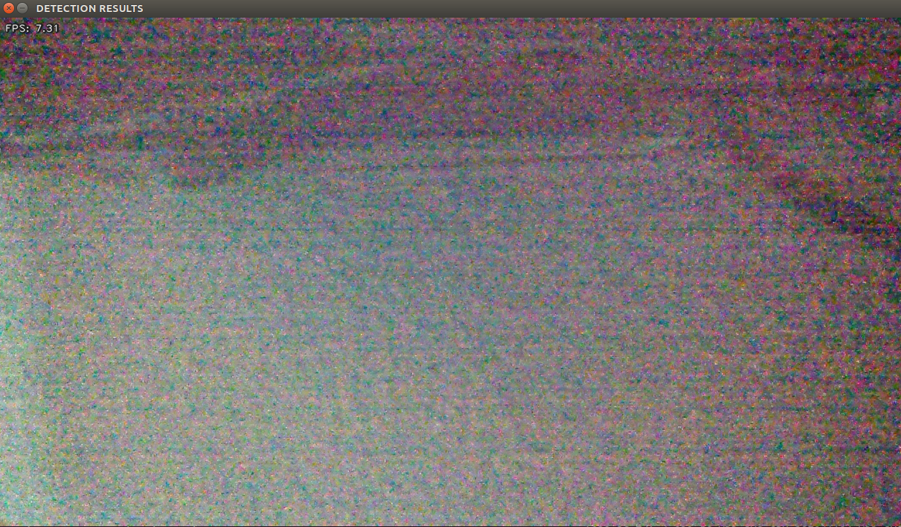

# YOLOv4 with TensorRT engine

This package contains the yolov4_trt_node that performs the inference using NVIDIA's TensorRT engine

This package works for both YOLOv3 and YOLOv4. Do change the commands accordingly, corresponding to the YOLO model used.

Average FPS for yolov4-416 on a 640x360 input is ~ 8-9 FPS

Average FPS w maximum performace on Jetson is ~ 10-11 FPS


---
## Setting up the environment

### Install dependencies (ALREADY DONE)

### Current Environment:

- ROS 	   == Melodic

- DISTRO   == Ubuntu 18.04

- Jetson   == Tx2

- Jetpack  == 4.4

- CUDA     == 10.2


#### Dependencies:

- TensorRT == 6+

- OpenCV == 3.x +

- numpy == 1.15.1 +

- Protobuf == 3.8.0

- Pycuda == 2019.1.2

- onnx == 1.4.1 (depends on Protobuf)

### Install all dependencies with below commands

```
Install pycuda (takes awhile)
$ cd ${HOME}/catkin_ws/src/yolov4_trt_ros/dependencies
$ ./install_pycuda.sh

Install Protobuf (takes awhile)
$ cd ${HOME}/catkin_ws/src/yolov4_trt_ros/dependencies
$ ./install_protobuf-3.8.0.sh

Install onnx (depends on Protobuf above)
$ sudo pip3 install onnx==1.4.1
```

* Please also install [jetson-inference](https://github.com/dusty-nv/ros_deep_learning#jetson-inference)
* Note: This package uses similar nodes to ros_deep_learning package. Please place a CATKIN_IGNORE in that package to avoid similar node name catkin_make error
---
## Setting up the package (START HERE)

Start by going into the _~/Documents/ros-docker-car_ and run `./run.bash`

### 1. Install jetson inference

Run these commands one-by-one without the comments (anything after a #)

``` 
$ sudo chown -R developer:1000 catkin_ws
$ sudo chown -R developer:1000 .ros
$ cd catkin_ws/src/jetson-inference
$ sudo rm -rd build/
$ sudo chmod +777 install_jetson_inference.sh
$ sudo ./install_jetson_inference.sh  # Will take around 10 minutes
```

### 2. Make

Run these commands one-by-one without the comments (anything after a #)

```
$ cd ~/catkin_ws
$ catkin_make
$ source devel/setup.bash
$ cd src/yolov4_trt_ros/plugins
$ make  # If it says “Nothing to be done for all”, it’s fine
```


### 3. Random steps

These are patches, could be moved into the dockerfile in the future, but until then, just run commands.

```
$ sudo apt install python-pip  # We need to install pip for python2.7 too
$ pip install pycuda   # Will take around 5 minutes
```

Open another terminal (on the host) and run:
```
$ xhost +
```

You may now move on to using the package section down below.

---
## Using the package

### Running the package

*Note: Run the launch files separately in different terminals. To do so, run `./exec_me.bash` but make sure you also run `cd ~/catkin_ws` && `source devel/setup.bash`*

### 1. Run the video_source 

```
# For csi input
$ roslaunch yolov4_trt_ros video_source.launch input:=csi://0

# For video input
$ roslaunch yolov4_trt_ros video_source.launch input:=/path_to_video/video.mp4
```

### 2. Run the yolo detector

```
# For YOLOv3
$ roslaunch yolov4_trt_ros yolov3_trt.launch

# For YOLOv4
$ roslaunch yolov4_trt_ros yolov4_trt.launch
```

### 3. For maximum performance (AVOID FOR NOW)

```
$ cd /usr/bin/
$ sudo ./nvpmodel -m 0	# Enable 2 Denver CPU
$ sudo ./jetson_clock	# Maximise CPU/GPU performance
```

* Please ensure the jetson device is cooled appropriately to prevent overheating

### Parameters

- str model = "yolov3" or "yolov4" 
- str model_path = "/abs_path_to_model/"
- int input_shape = 288/416/608
- int category_num = 80
- double conf_th = 0.5
- bool show_img = True

- Default Input FPS from CSI camera = 30.0
* To change this, go to jetson-inference/utils/camera/gstCamera.cpp line 359 and change `mOptions.frameRate = 15` to `mOptions.frameRate = desired_frame_rate`
---
## Results obtained

### 1. Screenshots 

### Video_in: .mp4 video (640x360)

### Avg FPS : ~9


---

### Video_in: CSI_cam (1280x720)

### Avg FPS : ~7




---
## Licenses and References

### 1. Referenced source code from [jkjung-avt](https://github.com/jkjung-avt/) and his project with tensorrt samples

I also used the pycuda and protobuf installation script from his project

Those code are under [MIT License](https://github.com/jkjung-avt/tensorrt_demos/blob/master/LICENSE)

### 2. Referenced video_input source code from [dusty-nv](https://github.com/dusty-nv/ros_deep_learning#jetson-inference)
