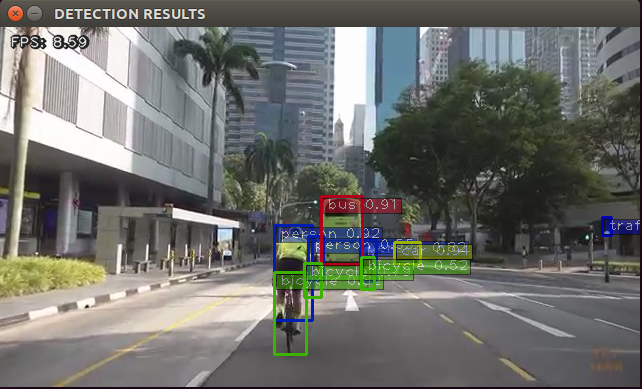

# YOLOv4 with TensorRT engine

This package contains the yolov4_trt_node that performs the inference using NVIDIA's TensorRT engine

Average FPS for 640x320 input is ~ 9 FPS


---
## Setting up the environment

### Install dependencies

### Current Environment:

- Jetson   == Tx2

- Jetpack  == 4.4

- CUDA     == 10.2

#### Dependencies:

- TensorRT == 6+

- OpenCV == 3.x +

- numpy == 1.15.1 +

- Protobuf == 3.8.0

- Pycuda == 2019.1.2

- onnx == 1.4.1 (depends on Protobuf)

### Install all dependencies with below commands

```
Install pycuda (takes awhile)
$ ./install_pycuda.sh

Install Protobuf (takes awhile)
$ ./install_protobuf-3.8.0.sh

Install onnx (depends on Protobuf above)
$ sudo pip3 install onnx==1.4.1
```

* If you are using the camera capture (roslaunch , please also install [jetson-inference](https://github.com/dusty-nv/ros_deep_learning#jetson-inference)
---
## Setting up the package

### 1. Clone project into catkin_ws and build it

``` 
$ cd ~/catkin_ws && catkin_make
$ source devel/setup.bash
```

### 2. Make libyolo_layer.so

```
$ cd ${HOME}/catkin_ws/src/yolov4_trt/plugins
$ make
```

This will generate a libyolo_layer.so file

### 3. Change libyolo_layer.so path in yolo_with_plugins_v4.py

```
$ cd ${HOME}/catkin_ws/src/yolov4_trt/utils
```

Change the path in Line 13 to the correct full path of the previously built `libyolo_layer.so` file

### 4. Place your yolo.weights and yolo.cfg file in the yolo folder

```
$ cd ${HOME}/catkin_ws/src/yolov4_trt/yolo
```
*** Please name the yolov4.weights and yolov4.cfg file as follows:
- yolov4-416.weights (replace 416 with any input shape you want) (input_shape = 288/416/608 etc.)
- yolov4-416.cfg

```
$ python3 yolo_to_onnx.py -m yolov4-416
$ python3 onnx_to_tensorrt.py -m yolov4-416
```

- This conversion might take awhile
- The optimised TensorRT engine would now be saved as yolov4-416.trt

### 5. Change the class labels

```
$ cd ${HOME}/catkin_ws/src/yolov4_trt/utils
$ vim yolo_classes.py
```

- Change the class labels to suit your model

---
## Using the package

### Running the package

Note: Run the launch files separately in different terminals

### 1. Run the camera capture

```
# For csi input
$ roslaunch yolov4_trt video_source.launch input:=csi://0

# For video input
$ roslaunch yolov4_trt video_source.launch input:=/path_to_video/video.mp4
```

### 2. Run the yolov4 detector

```
$ roslaunch yolov4_trt yolov4_trt.launch
```

### Parameters

- str model = "yolov4" 
- str model_path = "/abs_path_to_model/"
- int input_shape = 416
- int category_num = 80
- double conf_th = 0.5
- bool show_img = True

---
## Results obtained

### 1. Screenshots 

### Video_in: .mp4 video (640x360)

### Avg FPS : ~9




---

### Video_in: CSI_cam (1280x720)

### Avg FPS : ~7


---
## Licenses and References

Referenced source code from [jkjung-avt](https://github.com/jkjung-avt/) and his project with tensorrt samples

I also used the pycuda and protobuf installation script from his project

Those code are under [MIT License](https://github.com/jkjung-avt/tensorrt_demos/blob/master/LICENSE)
